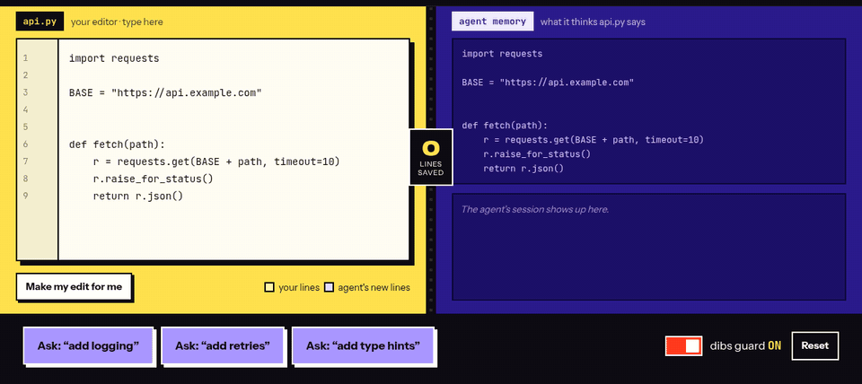

<div dir="rtl">

# dibs

**ویرایش‌های شما مال شماست.** dibs نمی‌گذارد ایجنت‌های برنامه‌نویسی هوش مصنوعی (Claude Code، Codex، Cursor،
Gemini CLI، Copilot، Aider و…) تغییراتی را که خودتان با دست داده‌اید بازنویسی کنند، و به همه می‌گوید چه
چیزی هنوز کامیت یا پوش نشده است.

[English](README.md) · [وب‌سایت](https://mrzroot.github.io/dibs/) · مجوز MIT · پایتون ۳٫۹ به بالا · بدون وابستگی


<p align="center"><a href="https://mrzroot.github.io/dibs/?lang=fa"></a></p>

**شروع سریع:**

```bash
pipx install git+https://github.com/mrzroot/dibs@v0.1.1
cd your-project && dibs init && dibs doctor
```


## مشکل

شما وسط کار، یک خط را دستی درست می‌کنید (مثلاً timeout را از ۱۰ به ۳۰ می‌رسانید). نوبت بعد از ایجنت
می‌خواهید «لاگ اضافه کن» و ایجنت تابع را از روی حافظهٔ خودش دوباره می‌نویسد؛ timeout=10 برمی‌گردد.
ایجنت‌ها ویرایش‌های بین دو نوبت را نمی‌بینند و آن‌ها را «درست» می‌کنند. تیم Cursor در انجمن خودش این را
مشکل شناخته‌شده می‌داند و برنامه‌ای برای رفعش اعلام نکرده است.

## dibs چه می‌کند

- **دفتر انتساب:** هر تغییر فایل با نام کسی که آن را داده ثبت می‌شود: `human` (شما)، `claude`، `cursor`،
  `codex`، `gemini`، `copilot`، `aider` یا هر نام دیگر، همراه با خطوط تغییرکرده.
- **گزارش اول هر نوبت:** وقتی پیام می‌فرستید، ایجنت اول یک یادداشت کوتاه «[dibs]» می‌گیرد: فایل‌هایی که
  از نوبت قبلش دستی تغییر داده‌اید، با خود خطوط، و این‌که «این‌ها را برنگردان».
- **نگهبان برگرداندن:** پیش از هر ویرایش ایجنت، dibs بررسی می‌کند که آیا خطی را که شما اضافه کرده‌اید حذف
  می‌کند یا خطی را که پاک کرده‌اید برمی‌گرداند. در Claude Code از شما اجازه گرفته می‌شود؛ در Codex و Cursor و
  Gemini ویرایش رد می‌شود و دلیلش به ایجنت گفته می‌شود.
- **تشخیص بعد از واقعه:** برگرداندن‌هایی که با دستورهای شل (sed، اسکریپت و…) انجام شوند بعد از اجرا پیدا
  می‌شوند، به ایجنت گزارش می‌شوند، در `dibs status` دیده می‌شوند و هوک pre-commit جلوی کامیتشان را می‌گیرد.
- **بازگردانی:** `dibs restore file` فقط خطوط شما را برمی‌گرداند و بقیهٔ کار ایجنت را نگه می‌دارد (ادغام
  سه‌طرفه). با `--whole` آخرین نسخهٔ خودتان از کل فایل برمی‌گردد.
- **وضعیت همگام‌سازی:** فایل‌های کامیت‌نشده، کامیت‌های پوش‌نشده، شاخه‌هایی که هرگز پوش نشده‌اند، stashها،
  مخزن بدون remote و پوشه‌ای که اصلاً گیت نیست؛ هم برای شما و هم برای ایجنت.

دفتر در `.git/dibs/` (یا بیرون از گیت در `.dibs/`) نگه داشته می‌شود، هرگز کامیت نمی‌شود و چیزی از
رایانهٔ شما بیرون نمی‌رود.

## نصب

هنوز در PyPI منتشر نشده است؛ از گیت‌هاب نصب کنید:

```bash
pipx install git+https://github.com/mrzroot/dibs@v0.1.1
# یا
uv tool install git+https://github.com/mrzroot/dibs@v0.1.1
```

سپس در هر مخزن:

```bash
cd your-project
dibs init            # ایجنت‌ها را خودش تشخیص می‌دهد؛ یا dibs init --all
dibs status
```

دستور `dibs` باید در PATH باشد، چون هوک‌ها آن را با نام صدا می‌زنند.

## dibs init چه چیزهایی را وصل می‌کند

| ایجنت | روش اتصال | گزارش نوبت | نگهبان پیش از ویرایش |
|---|---|---|---|
| Claude Code | هوک‌های `.claude/settings.json` | دارد | از شما می‌پرسد |
| Codex CLI | `.codex/hooks.json` (یک بار `codex` را اجرا کنید و «Trust all and continue» را بزنید) و AGENTS.md | دارد | رد می‌کند |
| Cursor | `.cursor/hooks.json` و قانون `.cursor/rules/dibs.mdc` | همراه پیام (و تکرار بعد از اولین ابزار) | رد می‌کند |
| Gemini CLI | هوک‌های `.gemini/settings.json` (فقط در پوشهٔ مورد اعتماد) | دارد | رد می‌کند |
| Copilot | سرور MCP در `.vscode/mcp.json` و دستورالعمل Copilot | ابزار `dibs_brief` | ابزار `dibs_check_edit` |
| Aider و بقیه | بلوک AGENTS.md یا `dibs run --agent aider -- aider` | در شروع | بعد از واقعه |

به‌علاوهٔ هوک pre-commit گیت. `dibs uninstall` همه را برمی‌دارد و به هوک‌های خودتان دست نمی‌زند.

## دستورها

```text
dibs status            وضعیت همگام‌سازی، ایجنت‌ها، خطوط برگردانده‌شده، تغییرات اخیر
dibs sync              کامیت‌نشده / پوش‌نشده / بدون remote
dibs log --diff        تاریخچهٔ تغییرات با نام سازنده
dibs blame FILE        هر خط را آخرین بار چه کسی نوشته (شما یا کدام ایجنت)
dibs restore FILE      برگرداندن خطوط شما
dibs ack / allow       پذیرفتن یک برگرداندن / اجازهٔ موقت تغییر خطوط شما
dibs brief / done      شروع و پایان نوبت برای ایجنت‌های بدون هوک
dibs run --agent A -- CMD    اجرای یک جلسهٔ کامل ایجنت به‌عنوان یک نوبت
dibs watch             ثبت پیوستهٔ ویرایش‌های شما با زمان دقیق
dibs doctor            بررسی اینکه هر ایجنت واقعاً هوک‌ها را اجرا می‌کند
dibs mcp               سرور MCP
dibs config guard warn       حالت نگهبان: auto | ask | deny | warn | off
```

## با چه چیزهایی واقعاً آزموده شده

روی لینوکس (اکتبر ۲۰۲۶) با **خود CLI ایجنت‌ها** و یک مدل ساختگی محلی ([`scripts/e2e`](scripts/e2e)) آزموده
شده: CLI، تجزیهٔ تنظیمات، اجراکنندهٔ هوک و ابزارها واقعی‌اند و فقط پاسخ مدل از پیش نوشته شده است. سناریو:
ایجنت فایل را می‌نویسد ← شما یک خط را دستی عوض می‌کنید ← ایجنت فایل را از حافظه بازنویسی می‌کند ← dibs
جلویش را می‌گیرد یا گزارش می‌دهد ← `dibs restore` و نگهبان pre-commit.

| ایجنت | نسخه | نگهبان پیش از ویرایش | تشخیص برگرداندن با شل | رسیدن خلاصه به مدل | نتیجه |
|---|---|---|---|---|---|
| Claude Code | 2.1.295 | ✅ (پرسش؛ در TUI حتی در حالت accept-edits) | ✅ | ✅ | `-p` ده از ده؛ TUI تعاملی |
| Codex CLI | 0.162.0 | ✅ رد `apply_patch` | ✅ | ✅ | هفت از هفت؛ جریان Trust در TUI |
| Gemini CLI | 0.63.0 | ✅ (فقط پوشهٔ مورد اعتماد) | ✅ | ✅ | هشت از هشت |
| aider | 0.86.2 | ✗ فقط بعد از اجرا | ✅ | ✅ با `--read` | سه از سه |
| Cursor agent | 2026.10.01 | فقط آزمون واحد با ساختار خوانده‌شده از کد CLI | – | – | نیاز به حساب Cursor |
| Copilot | – | اجرا نشده | – | – | نیاز به VS Code و حساب Copilot |

آزموده نشده چون حساب لازم دارد: واکنش مدل‌های واقعی به پیام‌های dibs، Cursor به‌صورت کامل، Copilot، و ورود
اشتراکی Claude Code (مسیر کلید API آزموده شد). Codex هوک‌های پروژهٔ تأییدنشده را بی‌صدا رد می‌کند و Gemini
پوشهٔ نامطمئن را نادیده می‌گیرد؛ `dibs doctor` هر دو را گزارش می‌دهد. aider وسط کار با `--no-verify` کامیت
می‌کند، پس pre-commit جلویش را نمی‌گیرد؛ `dibs run` در پایان هشدار می‌دهد.

## محدودیت‌ها

- هوک‌ها قابلیت خود ایجنت‌ها هستند و بین نسخه‌ها تغییر می‌کنند؛ بعد از به‌روزرسانی ایجنت `dibs doctor` را اجرا کنید.
- اگر هم‌زمان با اجرای یک دستور شل ایجنت فایلی را ویرایش کنید، آن تغییر به ایجنت نسبت داده می‌شود.
- مقایسه در سطح خط کامل و بدون توجه به فاصله‌هاست.

## تفاوت با ابزارهای مشابه

git-ai و Agent Blame و agentdiff ثبت می‌کنند کدام خطوط را هوش مصنوعی نوشته و آن را به کامیت‌ها می‌چسبانند؛
dibs در طول جلسه کار می‌کند و پیش از خراب شدن، از ویرایش‌های کامیت‌نشدهٔ شما محافظت می‌کند. agentrec و
flashpoint بعد از خرابی امکان برگشت می‌دهند؛ dibs جلوی خرابی را می‌گیرد و فقط خطوط شما را برمی‌گرداند.

## مجوز

MIT © محمدرضا زارع ([mrzroot](https://github.com/mrzroot))

</div>
